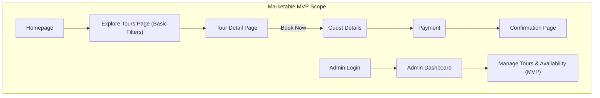
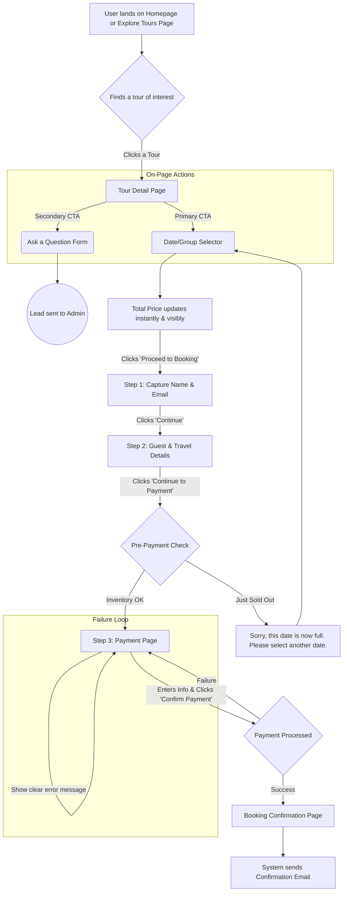

# Cape Town Safari Broker UI/UX Specification

This document defines the user experience goals, information architecture, user flows, and visual design specifications for the Cape Town Experience Broker website. It serves as the foundation for visual design and frontend development, ensuring a cohesive and user-centered experience based on the approved PRD.

## Introduction

### The Operational UX Framework

This framework is our constitution. It is the system we will use to make every design decision. It provides a clear hierarchy for resolving conflicts and measurable metrics for success.

#### The Hierarchy of Principles (The Tie-Breaker Rule)

1.  **Performance:** If it's slow, nothing else matters.
2.  **Clarity:** If users don't understand it, it doesn't exist.
3.  **Novice First (MVP Scope):** This principle guides our core user journey and MVP scope decisions.
4.  **Visual Storytelling:** The aesthetics and brand identity serve the principles above.

#### Principle-Driven Metrics

*   **Performance:** Achieve a Google Lighthouse performance score of 90+ for key pages; Largest Contentful Paint (LCP) under 2.5 seconds.
*   **Clarity:** Achieve a 90% task success rate for the core booking flow during user testing.
*   **Novice First:** Time-on-task for the booking flow should be under 3 minutes for the MVP.
*   **Visual Storytelling:** All "hero" images must be under 150KB.

### Change Log

| Date | Version | Description | Author |
| :--- | :--- | :--- | :--- |
| 2024-05-24 | 1.1 | Amended to reflect generalization from "Safari" to "Tour" per architectural feedback. | Sally (UX) |
| 2024-05-24 | 1.0 | Initial finalized draft of UI/UX Specification | Sally (UX) |

## Information Architecture (IA)

Our IA is phased to align with our "Marketable MVP" epic structure.

### Phase 1: The Marketable MVP IA (End of Epic 1)

This is the sitemap for our initial public launch, focused on the core commercial loop.



### Phase 2: The Full Vision IA (Post-MVP)

This diagram shows the full sitemap after all epics are complete.

```mermaid
graph TD
    subgraph Full Vision Scope
        A[Homepage] --> B[Explore Tours Page (Advanced Filters)]
        
        subgraph "Added in Epic 2: Scaling the Catalogue"
            C(Destination Guides)
            D(Wildlife Encyclopedia)
            G(Guide Detail Page)
            H(Wildlife Detail Page)
        end

        B --> F[Tour Detail Page]
        F -- "Learn More About..." --> C & D
        G -- "View Tours Here" --> B
        H -- "Find Tours to See This" --> B
        
        subgraph "Added in Epic 3: Building the Community"
            J(Login / Register)
            K(User Dashboard)
        end

        A --> J
        F -- "Add to..." --> K
        F -- "Book Now" --> O(Guest Details)
        O --> P(Payment)
        P --> Q[Confirmation Page]
        R[Admin Login] --> S[Admin Dashboard]
    end
```

### Navigation Structure

*   **Primary Navigation (MVP):** `Tours`, `(Future: Destinations)`, `(Future: Wildlife)`, `(Future: Blog)`, `(Future: Login)`.
*   **Breadcrumb Strategy:** A breadcrumb trail will be used on all nested pages (e.g., `Home > Tours > The Big 5 Adventure`).

## User Flows

### Core User Flow: Guest Tour Booking

*   **User Goal:** To find, select, and securely book a tour without creating an account.
*   **Success Criteria:** The user successfully completes a payment, sees a confirmation page, and receives a confirmation email.



## Wireframes & AI Generation Prompts

### The Governed AI Generation Workflow

Our design process will leverage Vercel's v0, governed by a strict framework:

1.  **Establish a "Prompt Style Guide."**
2.  **Human-Led, AI-Executed.**
3.  **Mandatory Human Review & Refinement.**
4.  **Create a Local Component Library.**

## Component Library / Design System

### The "Certified Component" Workflow

1.  **Specification:** Define the component's requirements.
2.  **Generation:** Use v0 to generate the draft code.
3.  **Certification:** A human developer reviews, refines, tests, and certifies the component.

### Expanded Core Components List (MVP)

*   **Primitives:** `Button`, `Link`, `Typography` components.
*   **Forms:** `Label`, `Input`, `Text Area`, `Date Picker`, `Form Group`.
*   **Overlays:** `Modal`, `Tooltip`.
*   **Layout:** `Header`, `Footer`, `Card`.
*   **App-Specific Components:** `Tour Card`, `Booking Widget`, `Checkout Progress Indicator`.

## Branding & Style Guide

### Visual Identity

*   **Action Item:** Create a mood board from 3-5 inspirational websites to finalize the aesthetic.

### Color Palette (with Accessibility Check)

| Color Type | Hex Code | Usage | WCAG AA Contrast |
| :--- | :--- | :--- | :--- |
| **Primary (Links)** | `#2C5282` | Main buttons, links, active states | **Passes (4.86:1)** |
| **Secondary (Accent)**| `#D69E2E` | **Decorative elements only** | **Fails (2.87:1)** |
| **Text** | `#1A202C` | All body text | **Passes (15.2:1)** |

### Typography

*   **Headings:** Montserrat
*   **Body:** Lato

### Spacing, Layout, and Personality

*   **Spacing:** A 4-pixel grid system, with an 8-point grid for larger layout elements.
*   **Border Radius:** A subtle, consistent radius (e.g., 4-6px) on buttons and cards.

## Accessibility Requirements

*   **Compliance Target:** WCAG 2.1 Level AA.
*   **Testing:** A mix of automated (Axe) and manual (keyboard, screen reader) testing.

## Responsiveness Strategy

*   **Breakpoints:** Standard mobile, tablet, desktop, and wide breakpoints.
*   **Adaptation:** Mobile-first, single-column layouts that expand to multi-column on larger screens.

## Performance Considerations

*   **Goals:** Google Lighthouse score of 90+, LCP < 2.5s, INP < 200ms.
*   **Strategies:** Prioritize above-the-fold content, aggressive image optimization, and static generation.
