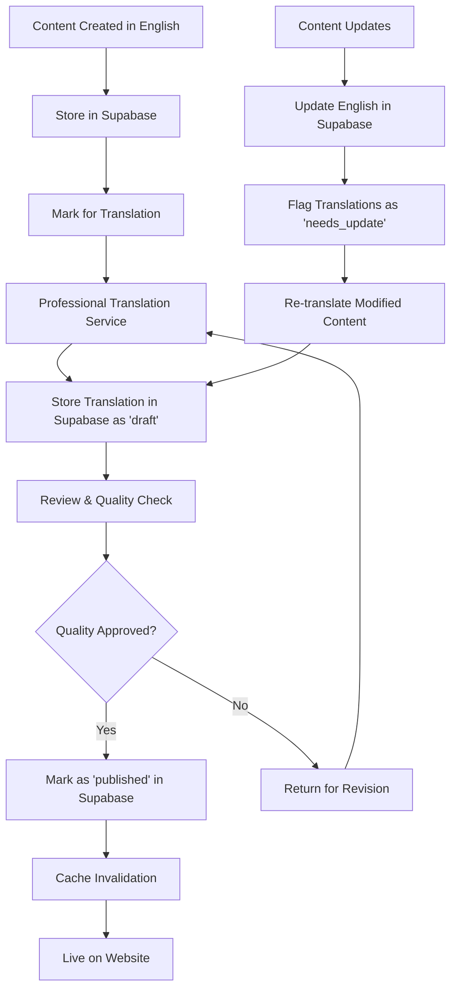

# Cape Town Safari Tours - Internationalization Architecture

## Executive Summary

This document outlines the comprehensive internationalization (i18n) architecture for Cape Town Safari Tours website, designed to support German (DE), French (FR), Spanish (ES), and Arabic (AR) languages while maintaining SEO excellence and performance.

## Current Architecture Analysis

### Existing Structure
- **Framework**: Next.js 15 with App Router
- **Routing**: File-based routing with dynamic segments
- **Database**: Supabase with PostgreSQL
- **SEO**: Comprehensive metadata, structured data, sitemap generation
- **Content**: Static pages + dynamic tour content from database

### Key Pages Identified
- Homepage (`/`)
- Tours listing (`/tours`)
- Tour details (`/tours/[slug]`)
- **Blog system (`/blog`, `/blog/[slug]`, `/blog/category/[slug]`)**
- About (`/about`)
- Contact (`/contact`)
- FAQ (`/faq`)
- Privacy Policy (`/privacy-policy`)
- Terms of Service (`/terms-of-service`)
- Safari Tours (`/safari-tours`)
- Cape Town Tours (`/cape-town-tours/table-mountain-tours`)

## Internationalization Architecture Design

### 1. URL Structure Strategy

#### Recommended Approach: Subdirectory with Locale Prefix
```
https://capetownsafaritours.com/          (English - default)
https://capetownsafaritours.com/de/       (German)
https://capetownsafaritours.com/fr/       (French)
https://capetownsafaritours.com/es/       (Spanish)
https://capetownsafaritours.com/ar/       (Arabic)
```

#### Benefits:
- **SEO Optimal**: Each language has dedicated URLs
- **User-Friendly**: Clear language indication in URL
- **Technical Simplicity**: Single domain management
- **Crawlability**: Search engines can easily index each language version

#### URL Examples:
```
Tours:
English:  /tours/aquila-big-5-day-safari
German:   /de/tours/aquila-big-5-day-safari
French:   /fr/tours/aquila-big-5-day-safari
Spanish:  /es/tours/aquila-big-5-day-safari
Arabic:   /ar/tours/aquila-big-5-day-safari

Blog:
English:  /blog/ultimate-cape-town-safari-guide
German:   /de/blog/ultimativer-kapstadt-safari-guide
French:   /fr/blog/guide-safari-cape-town-ultime
Spanish:  /es/blog/guia-safari-ciudad-cabo-definitiva
Arabic:   /ar/blog/دليل-سفاري-كيب-تاون-النهائي
```

### 2. Next.js App Router Implementation

#### Directory Structure
```
app/
├── [locale]/
│   ├── layout.tsx                 # Locale-specific layout
│   ├── page.tsx                   # Homepage
│   ├── about/
│   │   └── page.tsx
│   ├── contact/
│   │   └── page.tsx
│   ├── blog/                      # Blog system
│   │   ├── page.tsx               # Blog listing
│   │   ├── category/
│   │   │   └── [slug]/
│   │   │       └── page.tsx       # Category posts
│   │   └── [slug]/
│   │       └── page.tsx           # Individual blog post
│   ├── tours/
│   │   ├── page.tsx               # Tours listing
│   │   └── [slug]/
│   │       └── page.tsx           # Tour details
│   ├── faq/
│   │   └── page.tsx
│   └── ...
├── layout.tsx                     # Root layout
├── globals.css
├── sitemap.xml/
│   └── route.ts                   # Enhanced for i18n
└── robots.txt
```

#### Locale Configuration
```typescript
// lib/i18n/config.ts
export const locales = ['en', 'de', 'fr', 'es', 'ar'] as const;
export type Locale = typeof locales[number];

export const defaultLocale: Locale = 'en';

export const localeConfig = {
  en: { name: 'English', flag: '🇺🇸', dir: 'ltr' },
  de: { name: 'Deutsch', flag: '🇩🇪', dir: 'ltr' },
  fr: { name: 'Français', flag: '🇫🇷', dir: 'ltr' },
  es: { name: 'Español', flag: '🇪🇸', dir: 'ltr' },
  ar: { name: 'العربية', flag: '🇸🇦', dir: 'rtl' }
};
```

### 3. Middleware Architecture

#### Locale Detection & Routing
```typescript
// middleware.ts
import { NextRequest, NextResponse } from 'next/server';
import { locales, defaultLocale } from './lib/i18n/config';

export function middleware(request: NextRequest) {
  const pathname = request.nextUrl.pathname;
  
  // Check if pathname already has a locale
  const pathnameHasLocale = locales.some(
    locale => pathname.startsWith(`/${locale}/`) || pathname === `/${locale}`
  );

  if (pathnameHasLocale) return;

  // Detect locale from headers
  const locale = getLocaleFromRequest(request) || defaultLocale;
  
  // Redirect to localized URL
  if (locale !== defaultLocale) {
    return NextResponse.redirect(
      new URL(`/${locale}${pathname}`, request.url)
    );
  }
}

function getLocaleFromRequest(request: NextRequest): string | null {
  // Priority: URL param > Cookie > Accept-Language header
  const cookieLocale = request.cookies.get('locale')?.value;
  if (cookieLocale && locales.includes(cookieLocale as any)) {
    return cookieLocale;
  }

  const acceptLanguage = request.headers.get('accept-language');
  if (acceptLanguage) {
    for (const locale of locales) {
      if (acceptLanguage.includes(locale)) {
        return locale;
      }
    }
  }

  return null;
}

export const config = {
  matcher: [
    '/((?!api|_next/static|_next/image|favicon.ico|robots.txt|sitemap.xml).*)',
  ],
};
```

### 4. Database Schema Modifications

#### Complete Supabase Schema
**All multilingual content is stored in Supabase**, including tours, blog posts, and static translations.

```sql
-- Enhanced Tours Table with i18n support
ALTER TABLE tours ADD COLUMN locale VARCHAR(5) DEFAULT 'en';
ALTER TABLE tours ADD COLUMN translated_from UUID REFERENCES tours(id);
ALTER TABLE tours ADD COLUMN translation_status VARCHAR(20) DEFAULT 'original';

-- Tour translations table for detailed content
CREATE TABLE tour_translations (
  id UUID PRIMARY KEY DEFAULT gen_random_uuid(),
  tour_id UUID NOT NULL REFERENCES tours(id) ON DELETE CASCADE,
  locale VARCHAR(5) NOT NULL,
  title VARCHAR(255) NOT NULL,
  description TEXT NOT NULL,
  highlights TEXT[],
  inclusions TEXT[],
  important_info TEXT[],
  itinerary JSONB,
  faqs JSONB,
  meta_title VARCHAR(255),
  meta_description VARCHAR(500),
  translation_quality VARCHAR(20) DEFAULT 'draft',
  created_at TIMESTAMP DEFAULT NOW(),
  updated_at TIMESTAMP DEFAULT NOW(),
  UNIQUE(tour_id, locale)
);

-- Blog system tables
CREATE TABLE blog_categories (
  id UUID PRIMARY KEY DEFAULT gen_random_uuid(),
  slug VARCHAR(100) NOT NULL,
  locale VARCHAR(5) NOT NULL,
  name VARCHAR(100) NOT NULL,
  description TEXT,
  is_active BOOLEAN DEFAULT true,
  created_at TIMESTAMP DEFAULT NOW(),
  UNIQUE(slug, locale)
);

CREATE TABLE blog_posts (
  id UUID PRIMARY KEY DEFAULT gen_random_uuid(),
  slug VARCHAR(200) NOT NULL,
  locale VARCHAR(5) NOT NULL,
  translated_from UUID REFERENCES blog_posts(id),
  title VARCHAR(255) NOT NULL,
  excerpt VARCHAR(500),
  content TEXT NOT NULL,
  featured_image_url VARCHAR(500),
  category_id UUID REFERENCES blog_categories(id),
  tags TEXT[],
  meta_title VARCHAR(255),
  meta_description VARCHAR(500),
  status VARCHAR(20) DEFAULT 'draft',
  published_at TIMESTAMP,
  author_name VARCHAR(100),
  view_count INTEGER DEFAULT 0,
  reading_time_minutes INTEGER,
  created_at TIMESTAMP DEFAULT NOW(),
  updated_at TIMESTAMP DEFAULT NOW(),
  UNIQUE(slug, locale)
);

-- Static content translations
CREATE TABLE static_translations (
  id UUID PRIMARY KEY DEFAULT gen_random_uuid(),
  key VARCHAR(255) NOT NULL,
  locale VARCHAR(5) NOT NULL,
  value TEXT NOT NULL,
  context VARCHAR(100),
  is_approved BOOLEAN DEFAULT false,
  created_at TIMESTAMP DEFAULT NOW(),
  updated_at TIMESTAMP DEFAULT NOW(),
  UNIQUE(key, locale)
);
```

**See [`docs/supabase-i18n-blog-schema.md`](docs/supabase-i18n-blog-schema.md) for complete database schema with blog functionality.**

### 5. Content Management Strategy

#### Translation Workflow


#### Translation Management System
```typescript
// lib/i18n/translations.ts
export interface TranslationEntry {
  key: string;
  locale: Locale;
  value: string;
  context?: string;
  lastModified: Date;
  isOutdated: boolean;
}

export class TranslationManager {
  async getTranslation(key: string, locale: Locale): Promise<string> {
    // Check cache first
    const cached = await this.getCachedTranslation(key, locale);
    if (cached) return cached;

    // Fetch from database
    const translation = await this.fetchTranslation(key, locale);
    
    // Cache result
    await this.cacheTranslation(key, locale, translation);
    
    return translation || key; // Fallback to key if no translation
  }

  async updateTranslation(key: string, locale: Locale, value: string) {
    await this.saveTranslation(key, locale, value);
    await this.invalidateCache(key, locale);
  }
}
```

### 6. SEO Optimization Strategy

#### Metadata Generation
```typescript
// lib/i18n/metadata.ts
export function generateLocalizedMetadata(
  locale: Locale,
  page: string,
  data?: any
): Metadata {
  const baseUrl = process.env.NEXT_PUBLIC_BASE_URL;
  const localePath = locale === defaultLocale ? '' : `/${locale}`;
  
  return {
    title: getTranslation(`meta.${page}.title`, locale),
    description: getTranslation(`meta.${page}.description`, locale),
    alternates: {
      canonical: `${baseUrl}${localePath}/${page}`,
      languages: Object.fromEntries(
        locales.map(loc => [
          loc,
          `${baseUrl}${loc === defaultLocale ? '' : `/${loc}`}/${page}`
        ])
      )
    },
    openGraph: {
      title: getTranslation(`meta.${page}.title`, locale),
      description: getTranslation(`meta.${page}.description`, locale),
      url: `${baseUrl}${localePath}/${page}`,
      locale: locale,
      alternateLocale: locales.filter(l => l !== locale)
    },
    robots: {
      index: true,
      follow: true
    }
  };
}
```

#### Hreflang Implementation
```typescript
// components/i18n/HreflangLinks.tsx
export function HreflangLinks({ 
  currentLocale, 
  pathname 
}: { 
  currentLocale: Locale; 
  pathname: string; 
}) {
  return (
    <>
      {locales.map(locale => (
        <link
          key={locale}
          rel="alternate"
          hrefLang={locale}
          href={`${process.env.NEXT_PUBLIC_BASE_URL}${
            locale === defaultLocale ? '' : `/${locale}`
          }${pathname}`}
        />
      ))}
      <link
        rel="alternate"
        hrefLang="x-default"
        href={`${process.env.NEXT_PUBLIC_BASE_URL}${pathname}`}
      />
    </>
  );
}
```

#### Enhanced Sitemap Generation
```typescript
// app/sitemap.xml/route.ts (Enhanced)
export async function GET() {
  const baseUrl = process.env.NEXT_PUBLIC_BASE_URL;
  
  // Generate URLs for all locales
  const urls: string[] = [];
  
  for (const locale of locales) {
    const localePath = locale === defaultLocale ? '' : `/${locale}`;
    
    // Static pages
    staticPages.forEach(page => {
      urls.push(`
        <url>
          <loc>${baseUrl}${localePath}/${page}</loc>
          <lastmod>${new Date().toISOString()}</lastmod>
          <changefreq>weekly</changefreq>
          <priority>${page === '' ? '1.0' : '0.8'}</priority>
          <xhtml:link rel="alternate" hreflang="${locale}" href="${baseUrl}${localePath}/${page}"/>
          ${locales.map(altLocale => 
            altLocale !== locale ? 
            `<xhtml:link rel="alternate" hreflang="${altLocale}" href="${baseUrl}${altLocale === defaultLocale ? '' : `/${altLocale}`}/${page}"/>` 
            : ''
          ).join('')}
        </url>
      `);
    });
    
    // Dynamic tour pages
    const tours = await getToursByLocale(locale);
    tours.forEach(tour => {
      urls.push(`
        <url>
          <loc>${baseUrl}${localePath}/tours/${tour.slug}</loc>
          <lastmod>${tour.updated_at || new Date().toISOString()}</lastmod>
          <changefreq>weekly</changefreq>
          <priority>0.9</priority>
        </url>
      `);
    });
  }

  return new NextResponse(`<?xml version="1.0" encoding="UTF-8"?>
    <urlset xmlns="http://www.sitemaps.org/schemas/sitemap/0.9"
            xmlns:xhtml="http://www.w3.org/1999/xhtml">
      ${urls.join('\n')}
    </urlset>`, {
    headers: { 'Content-Type': 'application/xml' }
  });
}
```

### 7. Component Architecture

#### Internationalized Components
```typescript
// components/i18n/LocalizedText.tsx
interface LocalizedTextProps {
  textKey: string;
  locale: Locale;
  fallback?: string;
  values?: Record<string, string>;
}

export function LocalizedText({ 
  textKey, 
  locale, 
  fallback, 
  values 
}: LocalizedTextProps) {
  const translation = useTranslation(textKey, locale);
  
  if (!translation) {
    return <span>{fallback || textKey}</span>;
  }
  
  // Handle interpolation
  let text = translation;
  if (values) {
    Object.entries(values).forEach(([key, value]) => {
      text = text.replace(`{{${key}}}`, value);
    });
  }
  
  return <span>{text}</span>;
}

// components/i18n/LanguageSwitcher.tsx
export function LanguageSwitcher({ 
  currentLocale, 
  pathname 
}: { 
  currentLocale: Locale; 
  pathname: string; 
}) {
  return (
    <div className="language-switcher">
      {locales.map(locale => (
        <Link
          key={locale}
          href={`${locale === defaultLocale ? '' : `/${locale}`}${pathname}`}
          className={`language-option ${locale === currentLocale ? 'active' : ''}`}
        >
          <span className="flag">{localeConfig[locale].flag}</span>
          <span className="name">{localeConfig[locale].name}</span>
        </Link>
      ))}
    </div>
  );
}
```

#### RTL Support for Arabic
```typescript
// components/layout/LocalizedLayout.tsx
export function LocalizedLayout({ 
  locale, 
  children 
}: { 
  locale: Locale; 
  children: React.ReactNode; 
}) {
  const direction = localeConfig[locale].dir;
  
  return (
    <div 
      dir={direction}
      className={`locale-${locale} ${direction === 'rtl' ? 'rtl' : 'ltr'}`}
    >
      {children}
    </div>
  );
}
```

### 8. Performance Optimization

#### Caching Strategy
```typescript
// lib/i18n/cache.ts
export class I18nCache {
  private static instance: I18nCache;
  private cache = new Map<string, { value: string; expires: number }>();
  
  static getInstance(): I18nCache {
    if (!I18nCache.instance) {
      I18nCache.instance = new I18nCache();
    }
    return I18nCache.instance;
  }
  
  set(key: string, value: string, ttl: number = 3600000) { // 1 hour default
    this.cache.set(key, {
      value,
      expires: Date.now() + ttl
    });
  }
  
  get(key: string): string | null {
    const item = this.cache.get(key);
    if (!item) return null;
    
    if (Date.now() > item.expires) {
      this.cache.delete(key);
      return null;
    }
    
    return item.value;
  }
}
```

#### Bundle Optimization
```typescript
// next.config.mjs (Enhanced)
const nextConfig = {
  // ... existing config
  
  // Enable i18n optimizations
  experimental: {
    optimizePackageImports: ['@/lib/i18n']
  },
  
  // Webpack optimization for translations
  webpack: (config, { isServer }) => {
    if (!isServer) {
      // Split translation bundles by locale
      config.optimization.splitChunks.cacheGroups.translations = {
        name: 'translations',
        test: /[\\/]translations[\\/]/,
        chunks: 'all',
        priority: 10
      };
    }
    return config;
  }
};
```

### 9. Implementation Roadmap

#### Phase 1: Foundation (Week 1-2)
- [ ] Set up Next.js i18n configuration
- [ ] Implement middleware for locale detection
- [ ] Create basic directory structure
- [ ] Database schema modifications

#### Phase 2: Core Implementation (Week 3-4)
- [ ] Implement translation management system
- [ ] Create localized layouts and components
- [ ] Set up content translation workflow
- [ ] Implement language switcher

#### Phase 3: Content Translation (Week 5-8)
- [ ] Translate static content (German, French, Spanish)
- [ ] Translate tour content
- [ ] Arabic translation and RTL support
- [ ] Quality assurance and testing

#### Phase 4: SEO Optimization (Week 9-10)
- [ ] Implement hreflang tags
- [ ] Enhanced sitemap generation
- [ ] Localized metadata optimization
- [ ] Search console setup for each locale

#### Phase 5: Testing & Launch (Week 11-12)
- [ ] Comprehensive testing across all locales
- [ ] Performance optimization
- [ ] SEO audit and validation
- [ ] Gradual rollout and monitoring

### 10. Technical Considerations

#### Arabic (RTL) Specific Challenges
- **Layout Adjustments**: CSS modifications for right-to-left reading
- **Icon Positioning**: Mirror icons and directional elements
- **Form Layouts**: Adjust input field alignments
- **Navigation**: Reverse menu item order where appropriate

#### SEO Best Practices
- **Avoid Auto-Translation**: Use professional human translation
- **Consistent URL Structure**: Maintain logical URL patterns across locales
- **Proper Hreflang**: Implement comprehensive hreflang annotations
- **Local Search Optimization**: Optimize for local search terms in each language

#### Performance Considerations
- **Code Splitting**: Load only necessary translations
- **CDN Distribution**: Serve localized content from appropriate regions
- **Caching Strategy**: Implement aggressive caching for translations
- **Image Localization**: Consider locale-specific images where relevant

### 11. Monitoring & Analytics

#### Tracking Strategy
```typescript
// lib/analytics/i18n-tracking.ts
export function trackLanguageSwitch(fromLocale: Locale, toLocale: Locale) {
  gtag('event', 'language_switch', {
    from_language: fromLocale,
    to_language: toLocale,
    page_path: window.location.pathname
  });
}

export function trackLocalizedPageView(locale: Locale, page: string) {
  gtag('event', 'page_view', {
    language: locale,
    page_title: document.title,
    page_location: window.location.href
  });
}
```

#### Success Metrics
- **Traffic Distribution**: Monitor traffic across different locales
- **Conversion Rates**: Track booking conversions by language
- **Search Performance**: Monitor search rankings in different regions
- **User Engagement**: Analyze bounce rates and session duration by locale

## Conclusion

This internationalization architecture provides a robust, SEO-optimized foundation for expanding Cape Town Safari Tours to multiple languages. The implementation prioritizes performance, maintainability, and search engine optimization while ensuring a seamless user experience across all supported locales.

The phased approach allows for gradual implementation and testing, minimizing risks while maximizing the potential for international growth and improved search visibility.