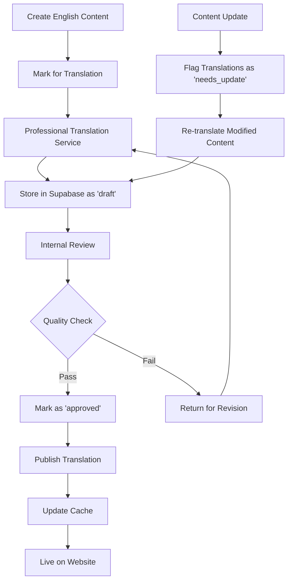
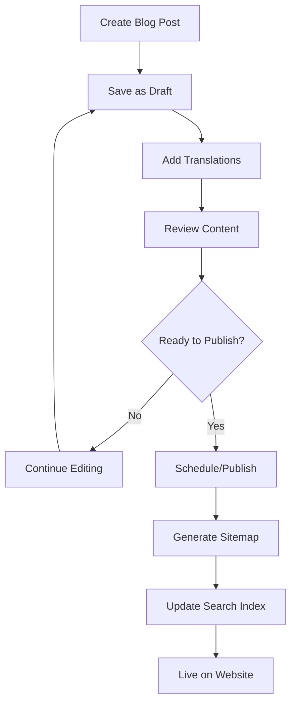

# Supabase I18n + Blog Architecture

## Overview

Yes, all multilingual content will be stored in Supabase, including the new blog functionality. This document outlines the complete database schema and implementation for internationalized content management.

## Enhanced Database Schema

### Core Tables Structure

```sql
-- =============================================
-- INTERNATIONALIZATION CORE TABLES
-- =============================================

-- Locales configuration table
CREATE TABLE locales (
  code VARCHAR(5) PRIMARY KEY,
  name VARCHAR(50) NOT NULL,
  native_name VARCHAR(50) NOT NULL,
  flag_emoji VARCHAR(10),
  direction VARCHAR(3) DEFAULT 'ltr' CHECK (direction IN ('ltr', 'rtl')),
  currency VARCHAR(3),
  region VARCHAR(2),
  is_active BOOLEAN DEFAULT true,
  sort_order INTEGER DEFAULT 0,
  created_at TIMESTAMP DEFAULT NOW(),
  updated_at TIMESTAMP DEFAULT NOW()
);

-- Insert supported locales
INSERT INTO locales (code, name, native_name, flag_emoji, direction, currency, region, sort_order) VALUES
('en', 'English', 'English', '🇺🇸', 'ltr', 'USD', 'US', 1),
('de', 'German', 'Deutsch', '🇩🇪', 'ltr', 'EUR', 'DE', 2),
('fr', 'French', 'Français', '🇫🇷', 'ltr', 'EUR', 'FR', 3),
('es', 'Spanish', 'Español', '🇪🇸', 'ltr', 'EUR', 'ES', 4),
('ar', 'Arabic', 'العربية', '🇸🇦', 'rtl', 'SAR', 'SA', 5);

-- =============================================
-- ENHANCED TOURS TABLES
-- =============================================

-- Main tours table (enhanced)
ALTER TABLE tours ADD COLUMN IF NOT EXISTS locale VARCHAR(5) DEFAULT 'en' REFERENCES locales(code);
ALTER TABLE tours ADD COLUMN IF NOT EXISTS translated_from UUID REFERENCES tours(id);
ALTER TABLE tours ADD COLUMN IF NOT EXISTS is_template BOOLEAN DEFAULT false;
ALTER TABLE tours ADD COLUMN IF NOT EXISTS translation_status VARCHAR(20) DEFAULT 'original' 
  CHECK (translation_status IN ('original', 'translated', 'needs_update', 'draft'));

-- Tour content translations (detailed content)
CREATE TABLE tour_translations (
  id UUID PRIMARY KEY DEFAULT gen_random_uuid(),
  tour_id UUID NOT NULL REFERENCES tours(id) ON DELETE CASCADE,
  locale VARCHAR(5) NOT NULL REFERENCES locales(code),
  
  -- Basic info
  title VARCHAR(255) NOT NULL,
  description TEXT NOT NULL,
  short_description VARCHAR(500),
  
  -- Detailed content
  highlights TEXT[],
  inclusions TEXT[],
  exclusions TEXT[],
  important_info TEXT[],
  what_to_bring TEXT[],
  
  -- Structured content
  itinerary JSONB, -- Array of day objects with title, description, activities
  faqs JSONB,      -- Array of FAQ objects with question, answer
  
  -- SEO content
  meta_title VARCHAR(255),
  meta_description VARCHAR(500),
  meta_keywords TEXT[],
  
  -- Content status
  translation_quality VARCHAR(20) DEFAULT 'draft' 
    CHECK (translation_quality IN ('draft', 'review', 'approved', 'published')),
  translated_by VARCHAR(100),
  reviewed_by VARCHAR(100),
  
  created_at TIMESTAMP DEFAULT NOW(),
  updated_at TIMESTAMP DEFAULT NOW(),
  
  UNIQUE(tour_id, locale)
);

-- =============================================
-- BLOG SYSTEM TABLES
-- =============================================

-- Blog categories
CREATE TABLE blog_categories (
  id UUID PRIMARY KEY DEFAULT gen_random_uuid(),
  slug VARCHAR(100) NOT NULL,
  locale VARCHAR(5) NOT NULL REFERENCES locales(code),
  name VARCHAR(100) NOT NULL,
  description TEXT,
  color VARCHAR(7), -- Hex color code
  sort_order INTEGER DEFAULT 0,
  is_active BOOLEAN DEFAULT true,
  created_at TIMESTAMP DEFAULT NOW(),
  updated_at TIMESTAMP DEFAULT NOW(),
  
  UNIQUE(slug, locale)
);

-- Blog posts main table
CREATE TABLE blog_posts (
  id UUID PRIMARY KEY DEFAULT gen_random_uuid(),
  slug VARCHAR(200) NOT NULL,
  locale VARCHAR(5) NOT NULL REFERENCES locales(code),
  translated_from UUID REFERENCES blog_posts(id),
  
  -- Content
  title VARCHAR(255) NOT NULL,
  excerpt VARCHAR(500),
  content TEXT NOT NULL,
  featured_image_url VARCHAR(500),
  featured_image_alt VARCHAR(255),
  
  -- Organization
  category_id UUID REFERENCES blog_categories(id),
  tags TEXT[],
  
  -- SEO
  meta_title VARCHAR(255),
  meta_description VARCHAR(500),
  meta_keywords TEXT[],
  
  -- Publishing
  status VARCHAR(20) DEFAULT 'draft' 
    CHECK (status IN ('draft', 'review', 'scheduled', 'published', 'archived')),
  published_at TIMESTAMP,
  scheduled_for TIMESTAMP,
  
  -- Author info
  author_name VARCHAR(100),
  author_email VARCHAR(255),
  author_bio TEXT,
  author_avatar_url VARCHAR(500),
  
  -- Engagement
  view_count INTEGER DEFAULT 0,
  like_count INTEGER DEFAULT 0,
  comment_count INTEGER DEFAULT 0,
  
  -- Reading time estimation
  reading_time_minutes INTEGER,
  word_count INTEGER,
  
  created_at TIMESTAMP DEFAULT NOW(),
  updated_at TIMESTAMP DEFAULT NOW(),
  
  UNIQUE(slug, locale)
);

-- Blog comments
CREATE TABLE blog_comments (
  id UUID PRIMARY KEY DEFAULT gen_random_uuid(),
  post_id UUID NOT NULL REFERENCES blog_posts(id) ON DELETE CASCADE,
  parent_id UUID REFERENCES blog_comments(id), -- For nested comments
  
  -- Comment content
  author_name VARCHAR(100) NOT NULL,
  author_email VARCHAR(255) NOT NULL,
  author_website VARCHAR(255),
  content TEXT NOT NULL,
  
  -- Moderation
  status VARCHAR(20) DEFAULT 'pending' 
    CHECK (status IN ('pending', 'approved', 'spam', 'rejected')),
  ip_address INET,
  user_agent TEXT,
  
  created_at TIMESTAMP DEFAULT NOW(),
  updated_at TIMESTAMP DEFAULT NOW()
);

-- =============================================
-- STATIC CONTENT TRANSLATIONS
-- =============================================

-- Static content translations (UI text, etc.)
CREATE TABLE static_translations (
  id UUID PRIMARY KEY DEFAULT gen_random_uuid(),
  key VARCHAR(255) NOT NULL,
  locale VARCHAR(5) NOT NULL REFERENCES locales(code),
  value TEXT NOT NULL,
  context VARCHAR(100), -- page, component, section
  description TEXT, -- For translators
  
  -- Translation management
  is_approved BOOLEAN DEFAULT false,
  translated_by VARCHAR(100),
  reviewed_by VARCHAR(100),
  
  created_at TIMESTAMP DEFAULT NOW(),
  updated_at TIMESTAMP DEFAULT NOW(),
  
  UNIQUE(key, locale)
);

-- =============================================
-- INDEXES FOR PERFORMANCE
-- =============================================

-- Tours indexes
CREATE INDEX idx_tours_locale ON tours(locale);
CREATE INDEX idx_tours_slug_locale ON tours(slug, locale);
CREATE INDEX idx_tours_status ON tours(translation_status);
CREATE INDEX idx_tour_translations_tour_locale ON tour_translations(tour_id, locale);
CREATE INDEX idx_tour_translations_quality ON tour_translations(translation_quality);

-- Blog indexes
CREATE INDEX idx_blog_posts_locale ON blog_posts(locale);
CREATE INDEX idx_blog_posts_slug_locale ON blog_posts(slug, locale);
CREATE INDEX idx_blog_posts_status ON blog_posts(status);
CREATE INDEX idx_blog_posts_published ON blog_posts(published_at DESC) WHERE status = 'published';
CREATE INDEX idx_blog_posts_category ON blog_posts(category_id);
CREATE INDEX idx_blog_posts_tags ON blog_posts USING GIN(tags);
CREATE INDEX idx_blog_categories_locale ON blog_categories(locale);
CREATE INDEX idx_blog_comments_post ON blog_comments(post_id);
CREATE INDEX idx_blog_comments_status ON blog_comments(status);

-- Static translations indexes
CREATE INDEX idx_static_translations_key_locale ON static_translations(key, locale);
CREATE INDEX idx_static_translations_context ON static_translations(context);

-- =============================================
-- ROW LEVEL SECURITY (RLS) POLICIES
-- =============================================

-- Enable RLS
ALTER TABLE tour_translations ENABLE ROW LEVEL SECURITY;
ALTER TABLE blog_posts ENABLE ROW LEVEL SECURITY;
ALTER TABLE blog_categories ENABLE ROW LEVEL SECURITY;
ALTER TABLE blog_comments ENABLE ROW LEVEL SECURITY;
ALTER TABLE static_translations ENABLE ROW LEVEL SECURITY;

-- Public read access for published content
CREATE POLICY "Public can read published tour translations" ON tour_translations
  FOR SELECT USING (translation_quality = 'published');

CREATE POLICY "Public can read published blog posts" ON blog_posts
  FOR SELECT USING (status = 'published');

CREATE POLICY "Public can read active blog categories" ON blog_categories
  FOR SELECT USING (is_active = true);

CREATE POLICY "Public can read approved comments" ON blog_comments
  FOR SELECT USING (status = 'approved');

CREATE POLICY "Public can read approved static translations" ON static_translations
  FOR SELECT USING (is_approved = true);

-- Admin full access (you'll need to implement proper auth)
CREATE POLICY "Admins can manage all content" ON tour_translations
  FOR ALL USING (auth.jwt() ->> 'role' = 'admin');

CREATE POLICY "Admins can manage blog posts" ON blog_posts
  FOR ALL USING (auth.jwt() ->> 'role' = 'admin');

-- =============================================
-- FUNCTIONS AND TRIGGERS
-- =============================================

-- Function to update updated_at timestamp
CREATE OR REPLACE FUNCTION update_updated_at_column()
RETURNS TRIGGER AS $$
BEGIN
    NEW.updated_at = NOW();
    RETURN NEW;
END;
$$ language 'plpgsql';

-- Apply to all tables
CREATE TRIGGER update_tours_updated_at BEFORE UPDATE ON tours
  FOR EACH ROW EXECUTE FUNCTION update_updated_at_column();

CREATE TRIGGER update_tour_translations_updated_at BEFORE UPDATE ON tour_translations
  FOR EACH ROW EXECUTE FUNCTION update_updated_at_column();

CREATE TRIGGER update_blog_posts_updated_at BEFORE UPDATE ON blog_posts
  FOR EACH ROW EXECUTE FUNCTION update_updated_at_column();

CREATE TRIGGER update_blog_categories_updated_at BEFORE UPDATE ON blog_categories
  FOR EACH ROW EXECUTE FUNCTION update_updated_at_column();

CREATE TRIGGER update_static_translations_updated_at BEFORE UPDATE ON static_translations
  FOR EACH ROW EXECUTE FUNCTION update_updated_at_column();

-- Function to automatically update comment count
CREATE OR REPLACE FUNCTION update_blog_comment_count()
RETURNS TRIGGER AS $$
BEGIN
  IF TG_OP = 'INSERT' THEN
    UPDATE blog_posts 
    SET comment_count = comment_count + 1 
    WHERE id = NEW.post_id;
    RETURN NEW;
  ELSIF TG_OP = 'DELETE' THEN
    UPDATE blog_posts 
    SET comment_count = comment_count - 1 
    WHERE id = OLD.post_id;
    RETURN OLD;
  END IF;
  RETURN NULL;
END;
$$ language 'plpgsql';

CREATE TRIGGER update_comment_count_trigger
  AFTER INSERT OR DELETE ON blog_comments
  FOR EACH ROW EXECUTE FUNCTION update_blog_comment_count();

-- Function to calculate reading time
CREATE OR REPLACE FUNCTION calculate_reading_time(content_text TEXT)
RETURNS INTEGER AS $$
DECLARE
  word_count INTEGER;
  reading_time INTEGER;
BEGIN
  -- Count words (approximate)
  word_count := array_length(string_to_array(content_text, ' '), 1);
  
  -- Average reading speed: 200 words per minute
  reading_time := CEIL(word_count::FLOAT / 200);
  
  -- Minimum 1 minute
  IF reading_time < 1 THEN
    reading_time := 1;
  END IF;
  
  RETURN reading_time;
END;
$$ language 'plpgsql';

-- Trigger to auto-calculate reading time and word count
CREATE OR REPLACE FUNCTION update_blog_post_stats()
RETURNS TRIGGER AS $$
BEGIN
  NEW.word_count := array_length(string_to_array(NEW.content, ' '), 1);
  NEW.reading_time_minutes := calculate_reading_time(NEW.content);
  RETURN NEW;
END;
$$ language 'plpgsql';

CREATE TRIGGER update_blog_stats_trigger
  BEFORE INSERT OR UPDATE ON blog_posts
  FOR EACH ROW EXECUTE FUNCTION update_blog_post_stats();
```

## Blog URL Structure

### Multilingual Blog URLs
```
English (default):  /blog
                    /blog/category/safari-tips
                    /blog/ultimate-cape-town-safari-guide

German:             /de/blog
                    /de/blog/category/safari-tipps
                    /de/blog/ultimativer-kapstadt-safari-guide

French:             /fr/blog
                    /fr/blog/category/conseils-safari
                    /fr/blog/guide-safari-cape-town-ultime

Spanish:            /es/blog
                    /es/blog/category/consejos-safari
                    /es/blog/guia-safari-ciudad-cabo-definitiva

Arabic:             /ar/blog
                    /ar/blog/category/نصائح-السفاري
                    /ar/blog/دليل-سفاري-كيب-تاون-النهائي
```

## Next.js App Router Structure (Enhanced)

```
app/
├── [locale]/
│   ├── blog/
│   │   ├── page.tsx                    # Blog listing
│   │   ├── category/
│   │   │   └── [slug]/
│   │   │       └── page.tsx            # Category posts
│   │   └── [slug]/
│   │       └── page.tsx                # Individual blog post
│   ├── tours/
│   │   ├── page.tsx
│   │   └── [slug]/
│   │       └── page.tsx
│   └── ...
├── api/
│   ├── blog/
│   │   ├── posts/
│   │   │   └── route.ts                # CRUD operations
│   │   ├── categories/
│   │   │   └── route.ts
│   │   └── comments/
│   │       └── route.ts
│   └── translations/
│       └── route.ts                    # Translation management
└── ...
```

## TypeScript Types

```typescript
// types/blog.ts
export interface BlogPost {
  id: string;
  slug: string;
  locale: string;
  translated_from?: string;
  title: string;
  excerpt?: string;
  content: string;
  featured_image_url?: string;
  featured_image_alt?: string;
  category_id?: string;
  category?: BlogCategory;
  tags: string[];
  meta_title?: string;
  meta_description?: string;
  meta_keywords: string[];
  status: 'draft' | 'review' | 'scheduled' | 'published' | 'archived';
  published_at?: string;
  scheduled_for?: string;
  author_name?: string;
  author_email?: string;
  author_bio?: string;
  author_avatar_url?: string;
  view_count: number;
  like_count: number;
  comment_count: number;
  reading_time_minutes?: number;
  word_count?: number;
  created_at: string;
  updated_at: string;
}

export interface BlogCategory {
  id: string;
  slug: string;
  locale: string;
  name: string;
  description?: string;
  color?: string;
  sort_order: number;
  is_active: boolean;
  created_at: string;
  updated_at: string;
}

export interface BlogComment {
  id: string;
  post_id: string;
  parent_id?: string;
  author_name: string;
  author_email: string;
  author_website?: string;
  content: string;
  status: 'pending' | 'approved' | 'spam' | 'rejected';
  created_at: string;
  replies?: BlogComment[];
}

// types/translations.ts
export interface TourTranslation {
  id: string;
  tour_id: string;
  locale: string;
  title: string;
  description: string;
  short_description?: string;
  highlights: string[];
  inclusions: string[];
  exclusions: string[];
  important_info: string[];
  what_to_bring: string[];
  itinerary: ItineraryDay[];
  faqs: FAQ[];
  meta_title?: string;
  meta_description?: string;
  meta_keywords: string[];
  translation_quality: 'draft' | 'review' | 'approved' | 'published';
  translated_by?: string;
  reviewed_by?: string;
  created_at: string;
  updated_at: string;
}

export interface ItineraryDay {
  day: number;
  title: string;
  description: string;
  activities: string[];
  meals?: string[];
  accommodation?: string;
}

export interface FAQ {
  question: string;
  answer: string;
  order?: number;
}

export interface StaticTranslation {
  id: string;
  key: string;
  locale: string;
  value: string;
  context?: string;
  description?: string;
  is_approved: boolean;
  translated_by?: string;
  reviewed_by?: string;
}
```

## Supabase Service Layer

```typescript
// lib/supabase/blog-service.ts
import { createClient } from '@supabase/supabase-js';
import { BlogPost, BlogCategory, BlogComment } from '@/types/blog';

export class BlogService {
  private supabase = createClient(
    process.env.NEXT_PUBLIC_SUPABASE_URL!,
    process.env.NEXT_PUBLIC_SUPABASE_ANON_KEY!
  );

  // Blog Posts
  async getPublishedPosts(locale: string, limit = 10, offset = 0): Promise<BlogPost[]> {
    const { data, error } = await this.supabase
      .from('blog_posts')
      .select(`
        *,
        category:blog_categories(*)
      `)
      .eq('locale', locale)
      .eq('status', 'published')
      .order('published_at', { ascending: false })
      .range(offset, offset + limit - 1);

    if (error) throw error;
    return data || [];
  }

  async getPostBySlug(slug: string, locale: string): Promise<BlogPost | null> {
    const { data, error } = await this.supabase
      .from('blog_posts')
      .select(`
        *,
        category:blog_categories(*)
      `)
      .eq('slug', slug)
      .eq('locale', locale)
      .eq('status', 'published')
      .single();

    if (error) {
      if (error.code === 'PGRST116') return null; // Not found
      throw error;
    }

    // Increment view count
    await this.incrementViewCount(data.id);

    return data;
  }

  async getPostsByCategory(categorySlug: string, locale: string): Promise<BlogPost[]> {
    const { data, error } = await this.supabase
      .from('blog_posts')
      .select(`
        *,
        category:blog_categories!inner(*)
      `)
      .eq('locale', locale)
      .eq('category.slug', categorySlug)
      .eq('status', 'published')
      .order('published_at', { ascending: false });

    if (error) throw error;
    return data || [];
  }

  async searchPosts(query: string, locale: string): Promise<BlogPost[]> {
    const { data, error } = await this.supabase
      .from('blog_posts')
      .select(`
        *,
        category:blog_categories(*)
      `)
      .eq('locale', locale)
      .eq('status', 'published')
      .or(`title.ilike.%${query}%,content.ilike.%${query}%,tags.cs.{${query}}`)
      .order('published_at', { ascending: false });

    if (error) throw error;
    return data || [];
  }

  // Categories
  async getCategories(locale: string): Promise<BlogCategory[]> {
    const { data, error } = await this.supabase
      .from('blog_categories')
      .select('*')
      .eq('locale', locale)
      .eq('is_active', true)
      .order('sort_order');

    if (error) throw error;
    return data || [];
  }

  // Comments
  async getComments(postId: string): Promise<BlogComment[]> {
    const { data, error } = await this.supabase
      .from('blog_comments')
      .select('*')
      .eq('post_id', postId)
      .eq('status', 'approved')
      .order('created_at', { ascending: true });

    if (error) throw error;
    return data || [];
  }

  async addComment(comment: Omit<BlogComment, 'id' | 'created_at' | 'updated_at'>): Promise<BlogComment> {
    const { data, error } = await this.supabase
      .from('blog_comments')
      .insert(comment)
      .select()
      .single();

    if (error) throw error;
    return data;
  }

  // Utility methods
  private async incrementViewCount(postId: string): Promise<void> {
    await this.supabase.rpc('increment_view_count', { post_id: postId });
  }
}

// lib/supabase/translation-service.ts
export class TranslationService {
  private supabase = createClient(
    process.env.NEXT_PUBLIC_SUPABASE_URL!,
    process.env.NEXT_PUBLIC_SUPABASE_ANON_KEY!
  );

  async getTourTranslation(tourId: string, locale: string): Promise<TourTranslation | null> {
    const { data, error } = await this.supabase
      .from('tour_translations')
      .select('*')
      .eq('tour_id', tourId)
      .eq('locale', locale)
      .eq('translation_quality', 'published')
      .single();

    if (error) {
      if (error.code === 'PGRST116') return null;
      throw error;
    }

    return data;
  }

  async getStaticTranslation(key: string, locale: string): Promise<string | null> {
    const { data, error } = await this.supabase
      .from('static_translations')
      .select('value')
      .eq('key', key)
      .eq('locale', locale)
      .eq('is_approved', true)
      .single();

    if (error) {
      if (error.code === 'PGRST116') return null;
      throw error;
    }

    return data.value;
  }

  async getStaticTranslations(locale: string, context?: string): Promise<Record<string, string>> {
    let query = this.supabase
      .from('static_translations')
      .select('key, value')
      .eq('locale', locale)
      .eq('is_approved', true);

    if (context) {
      query = query.eq('context', context);
    }

    const { data, error } = await query;

    if (error) throw error;

    return data.reduce((acc, item) => {
      acc[item.key] = item.value;
      return acc;
    }, {} as Record<string, string>);
  }
}
```

## Content Management Workflow

### Translation Workflow


### Blog Content Management


This enhanced architecture provides:

1. **Complete Supabase Storage**: All content (tours, blog, translations) stored in Supabase
2. **Multilingual Blog System**: Full blog functionality in all 5 languages
3. **Content Management**: Professional translation workflow with quality control
4. **SEO Optimization**: Proper URL structure and metadata for blog content
5. **Performance**: Efficient querying and caching strategies
6. **Scalability**: Modular design that can grow with your content needs

The blog system includes categories, tags, comments, and full SEO optimization for each language, making it a powerful content marketing tool for international audiences.