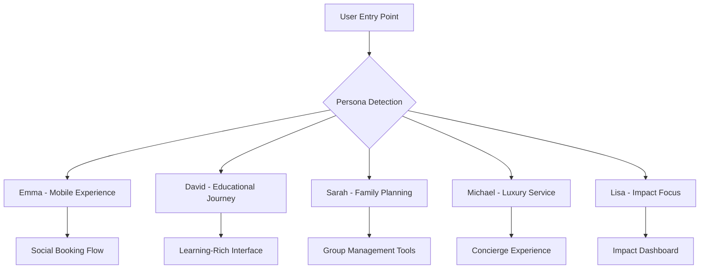

# Technical Implementation Plan - User Persona-Driven Architecture
## Cape Town Safari Tours Platform Enhancement

---

## 🎭 **USER PERSONAS & TECHNICAL REQUIREMENTS**

### **Primary Personas (Based on Market Analysis)**

#### **Persona 1: "Emma the Experience Seeker" (Gen Z/Millennial)**
**Demographics**: 25-35, European (German/UK), Digital Native, $50K+ income
**Behavioral Patterns**: Mobile-first, social media driven, values authenticity
**Technical Needs**: Fast mobile experience, visual content, social sharing, instant booking

#### **Persona 2: "David the Cultural Explorer" (Millennial/Gen X)**
**Demographics**: 35-45, International, High income, Education-focused
**Behavioral Patterns**: Research-heavy, values learning, seeks unique experiences
**Technical Needs**: Detailed information, educational content, expert guides, customization

#### **Persona 3: "Sarah the Family Organizer" (Gen X)**
**Demographics**: 40-50, Domestic/International, Family-focused, Safety-conscious
**Behavioral Patterns**: Plans ahead, values safety, needs group coordination
**Technical Needs**: Multi-person booking, safety information, family-friendly filters

#### **Persona 4: "Michael the Luxury Traveler" (Gen X/Boomer)**
**Demographics**: 45-65, High net worth, Convenience-focused, Quality-driven
**Behavioral Patterns**: Values premium service, willing to pay more, expects personalization
**Technical Needs**: Concierge service, premium experiences, seamless booking

#### **Persona 5: "Lisa the Conscious Traveler" (Millennial)**
**Demographics**: 28-40, Educated, Sustainability-focused, Purpose-driven
**Behavioral Patterns**: Researches impact, supports local communities, eco-conscious
**Technical Needs**: Impact metrics, community stories, sustainability information

---

## 🏗️ **PERSONA-DRIVEN TECHNICAL ARCHITECTURE**

### **Frontend Architecture by Persona**



### **Database Schema Extensions**

```typescript
// Enhanced user profiling
interface UserProfile {
  id: string;
  persona_type: 'experience_seeker' | 'cultural_explorer' | 'family_organizer' | 'luxury_traveler' | 'conscious_traveler';
  demographics: {
    age_range: string;
    location: string;
    income_bracket: string;
    travel_frequency: string;
  };
  behavioral_data: {
    device_preference: 'mobile' | 'desktop' | 'tablet';
    booking_pattern: 'impulse' | 'research_heavy' | 'planned' | 'last_minute';
    price_sensitivity: 'low' | 'medium' | 'high';
    group_size_preference: number;
  };
  preferences: {
    tour_types: string[];
    communication_style: 'visual' | 'detailed' | 'concise' | 'personal';
    booking_complexity: 'simple' | 'detailed' | 'custom';
  };
}

// Persona-specific tour recommendations
interface PersonalizedTour extends Tour {
  persona_match_score: number;
  customized_description: string;
  persona_specific_highlights: string[];
  recommended_add_ons: string[];
  social_proof_type: 'reviews' | 'bookings' | 'expert_endorsement' | 'community_impact';
}
```

---

## 📱 **PERSONA-SPECIFIC COMPONENT ARCHITECTURE**

### **Emma (Experience Seeker) - Mobile-First Components**

```typescript
// components/personas/emma/MobileBookingFlow.tsx
interface MobileBookingFlowProps {
  tour: Tour;
  userProfile: UserProfile;
}

export const MobileBookingFlow: React.FC<MobileBookingFlowProps> = ({ tour, userProfile }) => {
  return (
    <div className="mobile-optimized-flow">
      <InstagramStyleGallery images={tour.images} />
      <SocialProofBanner bookings={tour.recent_bookings} />
      <OneClickBooking tour={tour} />
      <ShareToSocial tour={tour} />
    </div>
  );
};

// components/personas/emma/SocialBookingWidget.tsx
interface SocialBookingWidgetProps {
  tour: Tour;
  socialProof: SocialProofData;
}

export const SocialBookingWidget: React.FC<SocialBookingWidgetProps> = ({ tour, socialProof }) => {
  const [showUrgency, setShowUrgency] = useState(false);
  
  return (
    <Card className="social-booking-widget">
      <LiveActivityFeed activity={socialProof.live_activity} />
      <InstagramStyleCTA tour={tour} />
      <FriendsWhoBookedThis friends={socialProof.friends_bookings} />
      <QuickShareOptions tour={tour} />
    </Card>
  );
};
```

### **David (Cultural Explorer) - Educational Components**

```typescript
// components/personas/david/EducationalTourInterface.tsx
interface EducationalTourInterfaceProps {
  tour: Tour;
  educationalContent: EducationalContent;
}

export const EducationalTourInterface: React.FC<EducationalTourInterfaceProps> = ({ tour, educationalContent }) => {
  return (
    <div className="educational-interface">
      <ExpertGuideProfile guide={tour.expert_guide} />
      <LearningObjectives objectives={educationalContent.learning_goals} />
      <HistoricalContext context={educationalContent.historical_background} />
      <InteractiveTimeline events={educationalContent.timeline} />
      <PreTourResources resources={educationalContent.preparation_materials} />
    </div>
  );
};

// components/personas/david/CulturalStorytellingWidget.tsx
interface CulturalStorytellingWidgetProps {
  stories: CulturalStory[];
  interactiveElements: InteractiveElement[];
}

export const CulturalStorytellingWidget: React.FC<CulturalStorytellingWidgetProps> = ({ stories, interactiveElements }) => {
  return (
    <div className="cultural-storytelling">
      <AudioNarrativePlayer stories={stories} />
      <InteractiveMap elements={interactiveElements} />
      <CommunityGuideIntroduction />
      <HistoricalContextOverlay />
    </div>
  );
};
```

### **Sarah (Family Organizer) - Group Management Components**

```typescript
// components/personas/sarah/FamilyBookingManager.tsx
interface FamilyBookingManagerProps {
  tour: Tour;
  familyRequirements: FamilyRequirements;
}

export const FamilyBookingManager: React.FC<FamilyBookingManagerProps> = ({ tour, familyRequirements }) => {
  return (
    <div className="family-booking-manager">
      <GroupSizeSelector maxSize={tour.max_group_size} />
      <AgeAppropriateFilters tour={tour} />
      <SafetyInformationPanel safety={tour.safety_measures} />
      <FamilyFriendlyAmenities amenities={tour.family_amenities} />
      <MultiPersonContactForm />
    </div>
  );
};

// components/personas/sarah/SafetyDashboard.tsx
interface SafetyDashboardProps {
  tour: Tour;
  safetyMetrics: SafetyMetrics;
}

export const SafetyDashboard: React.FC<SafetyDashboardProps> = ({ tour, safetyMetrics }) => {
  return (
    <Card className="safety-dashboard">
      <SafetyRating rating={safetyMetrics.overall_rating} />
      <GuideCredentials guide={tour.guide} />
      <EmergencyProtocols protocols={tour.emergency_procedures} />
      <InsuranceCoverage coverage={tour.insurance_details} />
      <ParentTestimonials testimonials={safetyMetrics.parent_reviews} />
    </Card>
  );
};
```

### **Michael (Luxury Traveler) - Premium Experience Components**

```typescript
// components/personas/michael/LuxuryConciergeInterface.tsx
interface LuxuryConciergeInterfaceProps {
  tour: Tour;
  conciergeServices: ConciergeServices;
}

export const LuxuryConciergeInterface: React.FC<LuxuryConciergeInterfaceProps> = ({ tour, conciergeServices }) => {
  return (
    <div className="luxury-concierge">
      <PersonalConciergeAssignment concierge={conciergeServices.assigned_concierge} />
      <PremiumUpgradeOptions upgrades={tour.premium_options} />
      <PrivateTransportOptions transport={conciergeServices.transport_options} />
      <ExclusiveExperienceAdd-ons addons={tour.exclusive_experiences} />
      <WhiteGloveService services={conciergeServices.white_glove_options} />
    </div>
  );
};

// components/personas/michael/PremiumBookingFlow.tsx
interface PremiumBookingFlowProps {
  tour: Tour;
  premiumOptions: PremiumOptions;
}

export const PremiumBookingFlow: React.FC<PremiumBookingFlowProps> = ({ tour, premiumOptions }) => {
  return (
    <div className="premium-booking-flow">
      <LuxuryTourPresentation tour={tour} />
      <PersonalizationConsultation />
      <PremiumPricingDisplay pricing={premiumOptions.pricing} />
      <ConciergeContactIntegration />
      <VIPTreatmentPreview />
    </div>
  );
};
```

### **Lisa (Conscious Traveler) - Impact-Focused Components**

```typescript
// components/personas/lisa/ImpactDashboard.tsx
interface ImpactDashboardProps {
  tour: Tour;
  impactMetrics: ImpactMetrics;
}

export const ImpactDashboard: React.FC<ImpactDashboardProps> = ({ tour, impactMetrics }) => {
  return (
    <div className="impact-dashboard">
      <CommunityImpactMetrics metrics={impactMetrics.community_impact} />
      <EnvironmentalFootprint footprint={impactMetrics.environmental_data} />
      <LocalPartnerStories partners={tour.community_partners} />
      <SustainabilityCertifications certifications={tour.sustainability_badges} />
      <CarbonOffsetCalculator tour={tour} />
    </div>
  );
};

// components/personas/lisa/CommunityStoryWidget.tsx
interface CommunityStoryWidgetProps {
  communityPartners: CommunityPartner[];
  impactStories: ImpactStory[];
}

export const CommunityStoryWidget: React.FC<CommunityStoryWidgetProps> = ({ communityPartners, impactStories }) => {
  return (
    <Card className="community-story-widget">
      <CommunityPartnerProfiles partners={communityPartners} />
      <ImpactStoryCarousel stories={impactStories} />
      <LocalEconomyContribution />
      <SustainabilityGoals />
    </Card>
  );
};
```

---

## 🧠 **PERSONA DETECTION & ROUTING SYSTEM**

### **Intelligent Persona Detection**

```typescript
// lib/personas/persona-detection.ts
interface PersonaDetectionData {
  userAgent: string;
  referralSource: string;
  browsingBehavior: BrowsingPattern;
  demographicHints: DemographicData;
  previousInteractions: InteractionHistory;
}

export class PersonaDetectionEngine {
  private mlModel: PersonaClassificationModel;
  
  constructor() {
    this.mlModel = new PersonaClassificationModel();
  }
  
  async detectPersona(data: PersonaDetectionData): Promise<PersonaType> {
    // Real-time persona detection using ML
    const features = this.extractFeatures(data);
    const prediction = await this.mlModel.predict(features);
    
    return {
      primary_persona: prediction.primary,
      confidence_score: prediction.confidence,
      secondary_personas: prediction.alternatives,
      detection_factors: prediction.factors
    };
  }
  
  private extractFeatures(data: PersonaDetectionData): FeatureVector {
    return {
      device_type: this.getDeviceType(data.userAgent),
      time_on_site: data.browsingBehavior.session_duration,
      pages_viewed: data.browsingBehavior.page_count,
      referral_category: this.categorizeReferral(data.referralSource),
      interaction_depth: data.browsingBehavior.interaction_score,
      price_sensitivity: this.inferPriceSensitivity(data.browsingBehavior),
      content_preference: this.analyzeContentEngagement(data.browsingBehavior)
    };
  }
}

// lib/personas/persona-router.ts
export class PersonaRouter {
  static getPersonaSpecificRoute(persona: PersonaType, basePath: string): string {
    const personaRoutes = {
      experience_seeker: `/mobile${basePath}`,
      cultural_explorer: `/educational${basePath}`,
      family_organizer: `/family${basePath}`,
      luxury_traveler: `/premium${basePath}`,
      conscious_traveler: `/impact${basePath}`
    };
    
    return personaRoutes[persona.primary_persona] || basePath;
  }
  
  static getPersonaSpecificComponents(persona: PersonaType): ComponentMap {
    return {
      booking_widget: this.getBookingWidget(persona),
      tour_display: this.getTourDisplay(persona),
      navigation: this.getNavigation(persona),
      content_layout: this.getContentLayout(persona)
    };
  }
}
```

### **Dynamic Component Loading**

```typescript
// components/PersonaAwareLayout.tsx
interface PersonaAwareLayoutProps {
  children: React.ReactNode;
  persona: PersonaType;
  tour?: Tour;
}

export const PersonaAwareLayout: React.FC<PersonaAwareLayoutProps> = ({ children, persona, tour }) => {
  const [components, setComponents] = useState<ComponentMap | null>(null);
  
  useEffect(() => {
    const loadPersonaComponents = async () => {
      const componentMap = PersonaRouter.getPersonaSpecificComponents(persona);
      
      // Dynamic imports based on persona
      const loadedComponents = await Promise.all([
        import(`./personas/${persona.primary_persona}/BookingWidget`),
        import(`./personas/${persona.primary_persona}/TourDisplay`),
        import(`./personas/${persona.primary_persona}/Navigation`)
      ]);
      
      setComponents({
        BookingWidget: loadedComponents[0].default,
        TourDisplay: loadedComponents[1].default,
        Navigation: loadedComponents[2].default
      });
    };
    
    loadPersonaComponents();
  }, [persona]);
  
  if (!components) return <LoadingSpinner />;
  
  const { BookingWidget, TourDisplay, Navigation } = components;
  
  return (
    <div className={`persona-layout persona-${persona.primary_persona}`}>
      <Navigation persona={persona} />
      <main>
        {tour && <TourDisplay tour={tour} persona={persona} />}
        {children}
        {tour && <BookingWidget tour={tour} persona={persona} />}
      </main>
    </div>
  );
};
```

---

## 🎨 **PERSONA-SPECIFIC STYLING SYSTEM**

### **Design System Extensions**

```typescript
// styles/personas/persona-themes.ts
export const personaThemes = {
  experience_seeker: {
    colors: {
      primary: '#FF6B6B',      // Vibrant coral
      secondary: '#4ECDC4',    // Turquoise
      accent: '#FFE66D',       // Bright yellow
      background: '#FFFFFF',
      text: '#2C3E50'
    },
    typography: {
      headings: 'Montserrat, sans-serif',
      body: 'Open Sans, sans-serif',
      sizes: {
        mobile_optimized: true,
        base_size: '16px'
      }
    },
    components: {
      buttons: 'rounded-full',
      cards: 'shadow-lg',
      spacing: 'compact'
    }
  },
  
  cultural_explorer: {
    colors: {
      primary: '#8B4513',      // Saddle brown
      secondary: '#D2691E',    // Chocolate
      accent: '#DAA520',       // Goldenrod
      background: '#FDF5E6',   // Old lace
      text: '#2F4F4F'
    },
    typography: {
      headings: 'Playfair Display, serif',
      body: 'Lora, serif',
      sizes: {
        reading_optimized: true,
        base_size: '18px'
      }
    },
    components: {
      buttons: 'rounded-md',
      cards: 'border-2',
      spacing: 'generous'
    }
  },
  
  family_organizer: {
    colors: {
      primary: '#2E8B57',      // Sea green
      secondary: '#98FB98',    // Pale green
      accent: '#FFB347',       // Peach
      background: '#F0F8FF',   // Alice blue
      text: '#2F4F4F'
    },
    typography: {
      headings: 'Nunito, sans-serif',
      body: 'Source Sans Pro, sans-serif',
      sizes: {
        family_friendly: true,
        base_size: '17px'
      }
    },
    components: {
      buttons: 'rounded-lg',
      cards: 'border',
      spacing: 'comfortable'
    }
  },
  
  luxury_traveler: {
    colors: {
      primary: '#1C1C1C',      // Rich black
      secondary: '#D4AF37',    // Gold
      accent: '#C0C0C0',       // Silver
      background: '#FFFEF7',   // Ivory
      text: '#2C2C2C'
    },
    typography: {
      headings: 'Cormorant Garamond, serif',
      body: 'Crimson Text, serif',
      sizes: {
        luxury_spacing: true,
        base_size: '19px'
      }
    },
    components: {
      buttons: 'rounded-none',
      cards: 'shadow-2xl',
      spacing: 'luxurious'
    }
  },
  
  conscious_traveler: {
    colors: {
      primary: '#228B22',      // Forest green
      secondary: '#32CD32',    // Lime green
      accent: '#8FBC8F',       // Dark sea green
      background: '#F5FFFA',   // Mint cream
      text: '#2F4F4F'
    },
    typography: {
      headings: 'Merriweather, serif',
      body: 'Source Sans Pro, sans-serif',
      sizes: {
        sustainability_focus: true,
        base_size: '16px'
      }
    },
    components: {
      buttons: 'rounded-md',
      cards: 'border-l-4',
      spacing: 'mindful'
    }
  }
};

// Tailwind CSS configuration extension
module.exports = {
  theme: {
    extend: {
      colors: {
        'emma-primary': personaThemes.experience_seeker.colors.primary,
        'david-primary': personaThemes.cultural_explorer.colors.primary,
        'sarah-primary': personaThemes.family_organizer.colors.primary,
        'michael-primary': personaThemes.luxury_traveler.colors.primary,
        'lisa-primary': personaThemes.conscious_traveler.colors.primary,
      }
    }
  }
};
```

---

## 📊 **PERSONA-DRIVEN ANALYTICS & OPTIMIZATION**

### **Analytics Framework**

```typescript
// lib/analytics/persona-analytics.ts
interface PersonaAnalytics {
  persona_type: PersonaType;
  conversion_metrics: ConversionMetrics;
  engagement_metrics: EngagementMetrics;
  satisfaction_metrics: SatisfactionMetrics;
}

export class PersonaAnalyticsEngine {
  async trackPersonaConversion(persona: PersonaType, event: ConversionEvent): Promise<void> {
    const analytics = {
      persona_primary: persona.primary_persona,
      persona_confidence: persona.confidence_score,
      conversion_step: event.step,
      conversion_value: event.value,
      time_to_convert: event.duration,
      device_type: event.device,
      traffic_source: event.source
    };
    
    await this.sendToAnalytics('persona_conversion', analytics);
  }
  
  async generatePersonaInsights(timeframe: string): Promise<PersonaInsights> {
    const data = await this.getPersonaData(timeframe);
    
    return {
      top_performing_persona: this.getTopPerformer(data),
      conversion_rates_by_persona: this.getConversionRates(data),
      engagement_patterns: this.getEngagementPatterns(data),
      optimization_opportunities: this.getOptimizationOpportunities(data)
    };
  }
}

// A/B Testing for Personas
export class PersonaABTesting {
  async createPersonaTest(persona: PersonaType, variants: TestVariant[]): Promise<ABTest> {
    return {
      test_id: generateTestId(),
      persona_target: persona,
      variants: variants,
      success_metrics: this.getPersonaSpecificMetrics(persona),
      duration: this.calculateOptimalDuration(persona),
      sample_size: this.calculateSampleSize(persona)
    };
  }
  
  private getPersonaSpecificMetrics(persona: PersonaType): SuccessMetrics {
    const metricsByPersona = {
      experience_seeker: ['conversion_rate', 'social_shares', 'mobile_completion'],
      cultural_explorer: ['time_on_page', 'content_engagement', 'educational_completion'],
      family_organizer: ['safety_confidence', 'group_booking_success', 'information_clarity'],
      luxury_traveler: ['premium_conversion', 'concierge_engagement', 'satisfaction_score'],
      conscious_traveler: ['impact_engagement', 'sustainability_score', 'community_connection']
    };
    
    return metricsByPersona[persona.primary_persona];
  }
}
```

---

## 🔄 **CONTINUOUS OPTIMIZATION FRAMEWORK**

### **Persona Evolution System**

```typescript
// lib/personas/persona-evolution.ts
export class PersonaEvolutionEngine {
  async updatePersonaModel(userId: string, newBehaviorData: BehaviorData): Promise<PersonaType> {
    const currentPersona = await this.getCurrentPersona(userId);
    const updatedPersona = await this.recalculatePersona(currentPersona, newBehaviorData);
    
    if (this.hasPersonaChanged(currentPersona, updatedPersona)) {
      await this.triggerPersonaTransition(userId, currentPersona, updatedPersona);
    }
    
    return updatedPersona;
  }
  
  private async triggerPersonaTransition(
    userId: string, 
    oldPersona: PersonaType, 
    newPersona: PersonaType
  ): Promise<void> {
    // Gradual UI transition to new persona experience
    await this.scheduleGradualTransition({
      user_id: userId,
      from_persona: oldPersona,
      to_persona: newPersona,
      transition_steps: this.generateTransitionSteps(oldPersona, newPersona),
      duration: '7_days'
    });
  }
}

// Real-time Personalization
export class RealTimePersonalization {
  async personalizeContent(
    userId: string, 
    content: Content, 
    context: RequestContext
  ): Promise<PersonalizedContent> {
    const persona = await this.getPersona(userId);
    const realtimeSignals = await this.getRealTimeSignals(userId, context);
    
    return {
      content: this.adaptContentToPersona(content, persona),
      layout: this.getPersonaLayout(persona),
      interactions: this.getPersonaInteractions(persona),
      messaging: this.getPersonaMessaging(persona, realtimeSignals)
    };
  }
}
```

---

## 🚀 **IMPLEMENTATION ROADMAP**

### **Phase 1: Foundation (Weeks 1-4)**
1. **Persona Detection System**: Implement ML-based persona classification
2. **Component Architecture**: Build persona-specific component library
3. **Routing System**: Dynamic routing based on persona detection
4. **Analytics Setup**: Persona-specific tracking and measurement

### **Phase 2: Persona Experiences (Weeks 5-12)**
1. **Emma Components**: Mobile-optimized, social-first experience
2. **David Components**: Educational, content-rich interface
3. **Sarah Components**: Family-focused, safety-emphasized design
4. **Michael Components**: Luxury, concierge-style experience
5. **Lisa Components**: Impact-focused, sustainability-driven interface

### **Phase 3: Optimization (Weeks 13-16)**
1. **A/B Testing**: Persona-specific optimization tests
2. **Machine Learning**: Improve persona detection accuracy
3. **Real-time Personalization**: Dynamic content adaptation
4. **Performance Optimization**: Ensure fast loading for all personas

### **Success Metrics by Persona**
- **Emma**: Mobile conversion rate >6%, Social shares +200%
- **David**: Time on educational content +150%, Expert guide bookings +80%
- **Sarah**: Family booking completion rate >90%, Safety confidence score >9/10
- **Michael**: Premium experience conversion >15%, Concierge engagement >70%
- **Lisa**: Impact content engagement +300%, Sustainability tour bookings +120%

This technical implementation plan provides a comprehensive, persona-driven architecture that adapts the entire user experience based on individual user characteristics and behaviors, ensuring maximum relevance and conversion for each user segment.